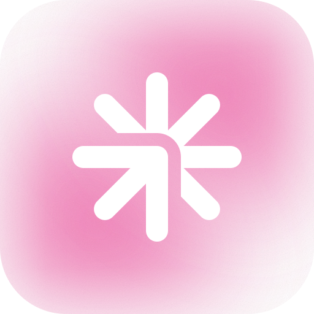

  

<h1 align="center">Motiou</h1>

  <strong>Beautiful Screen Recording for macOS</strong> 
  Record, edit, and export — all from one native app.

  
  
  

---

  
   
  ▶ Click to watch Motiou in action

---

### Features

**Recording**
- Screen recording — full screen, window, or custom region with pause/resume
- System and microphone audio capture
- Voice-over while you record
- iPhone and iPad recording over USB
- Device frames that match your hardware
- Recording countdown and focus panel

**Editing**
- Multi-track timeline with full control
- Auto-zoom on clicks — cinematic zoom that follows the cursor
- Manual zoom with keyframes and custom easing
- Source crop — trim the capture area before export
- Smart Cut — surfaces silences and filler words for quick trims
- Clip transitions — fade, slide, zoom, dissolve
- Scene overlays — intros, outros, and chapter-style scenes
- Cursor smoothing — Catmull-Rom and Gaussian for natural motion
- Motion blur on cursor and zoom
- 120fps real-time preview — what you see is what you export

**AI**
- AI voiceover and voice cloning — 14 presets, emotion control, 3-second cloning
- AI captions with word-level timing — fully on-device
- AI Smart Cut and Auto-Redact — remove silences and sensitive info
- AI auto-edit with scene detection
- Auto layouts — optimal crop based on screen activity

**Visual Polish**
- Click sounds and click visuals with authentic key-down/key-up audio
- Keystroke overlay for tutorials
- Privacy masks — blur, frosted, or solid with motion tracking
- Webcam PiP with background blur
- Touch visualization for iOS recordings
- Custom backgrounds and 137 built-in wallpapers
- Branding title overlay with full customization
- Music library and add-on packs with smart ducking

**Export**
- 4K at 120fps — H.264, HEVC, ProRes 422/4444, GIF, MP4, WebM
- Multi-platform batch export — YouTube, TikTok, X, LinkedIn
- SOP and tutorial document export — PDF, HTML, Markdown
- Nine quality presets from Lossless Master to Loop (GIF)

**Privacy**
- 100% on-device — recording, captions, redaction, and export run locally

### System Requirements

| | Requirement |
|---|---|
| **OS** | macOS 14.0 (Sonoma) or later |
| **CPU** | Apple Silicon or Intel |
| **Disk** | 500 MB free space |

---

  <a href="https://motiou.com">Website</a> · <a href="https://motiou.com/download">Download</a> · <a href="https://motiou.com/changelog">Changelog</a> · <a href="https://motiou.com/feedback">Feedback</a> · <a href="https://motiou.com/pricing">Pricing</a>

